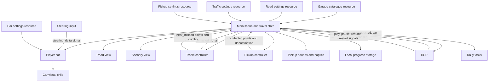

# Mahalla Cruise Architecture

Mahalla Cruise uses small Godot feature scenes with typed GDScript. The main
scene connects the features and owns shared progress. This structure supports
adding cars and scenery while keeping the first Android game manageable.

## Engine and Entry Point

Use **Godot 4.7.2 Standard**, GDScript, and the Compatibility renderer.
`project.godot` starts `src/main.tscn`. Artwork and driving coordinates are authored
for 432 × 768. Godot's canvas-items expand mode fills other aspect ratios. Main
centers that playfield, supplies visible bounds to road/scenery, and passes vertical
padding to traffic/pickups so objects enter and leave outside the expanded view.
HUD values follow the playfield; menu/result overlays center in the full viewport.
Resize pauses an active drive and clears steering gestures. Settings resources and
local collision coordinates stay unchanged; taller screens reveal more road.

## Feature Ownership

| Location | Responsibility |
| --- | --- |
| `src/main.gd` and `main.tscn` | Compose features, own run state, advance shared travel, and coordinate restart. |
| `src/driving/player_car.gd` | Own the player's position, steering target, road limits, and lean. |
| `src/driving/steering_input.gd` | Translate mouse, single-finger touch, and keyboard input. Cancel gestures on focus loss. |
| `src/driving/car_visual.gd` | Own the Damas sprite child and draw its shadow; leave steering and collision logic on the player. |
| `src/driving/car_settings.gd` and `default_car.tres` | Define and store car handling values. |
| `src/road/` | Store route settings and render scrolling lane markings above the street. |
| `src/scenery/` | Render the connected street surface, buildings, trees, and native bakery sign. |
| `src/traffic/` | Spawn and remove traffic, track contacts, and render sedan sprites using traffic settings. |
| `src/pickups/` | Spawn money, detect collection, render banknotes, and own a separate feedback scene for audio/haptics. |
| `src/progress/` | Own the versioned save document, local files, recovery, best score, wallet, and owned cars. |
| `src/audio/` | Own background music and the horn; main starts, pauses, and stops music with the run. |
| `src/daily/` | Draw today's tasks, apply finished runs, and present the tasks screen. |
| `src/garage/` | Define the car roster (`CarDefinition`, `GarageCatalogue`) and present the garage screen. |
| `src/ui/` | Present start/pause menus, first-run instructions, HUD values, and run results. |
| `tests/` and `scripts/` | Verify behavior and run development tools. |

Keep each feature's scenes, scripts, and default resources together. Imported
artwork and audio go under `assets/`, with source records. The Damas and sedan
share `assets/cars/vehicles_aligned.png`, using a centered elevated rear camera
with no diagonal heading. Player uses an AtlasTexture; traffic selects its region
when drawing. Both visuals draw soft ground shadows separately. Keep full source
dimensions for atlas coordinates, mipmaps, and linear filtering.

Scenery owns the connected `assets/scenery/mahalla_street.png` environment.
Its first 1540 source rows repeat every 720 game pixels, ending at the repeated
courtyard wall. Left sidewalk, asphalt, and right sidewalk are separate draw
regions mapped to RoadSettings edges, so art follows steering/collision bounds.
Scenery receives travel/reset commands from main and owns only its scroll offset.
Road draws lane markings above scenery at z=1; cars render at z=2; HUD uses a
CanvasLayer. Assets, original prompts and source records are in `assets/ANGLED_ART.md`.

## Connections and State

Parents call typed methods on their children. Children signal events upward.
The main scene routes communication between features. A feature must not reach
into a sibling, walk to a parent for hidden dependencies, or use `/root` lookups.
Do not add a global event bus, service locator, or autoload without approval.

`CruiseGame` owns travelled distance, run score, and currency counts. It distributes
the same pixel movement to road, scenery, and pickups each frame. `PlayerCar` owns its movement and uses the physics
clock. Renderers keep only their scrolling offsets; the HUD receives distance
through `set_distance()`. Views do not modify gameplay state.

The main scene owns `RunState` (START, PLAYING, PAUSED, GAME_OVER).
`is_game_over` is a derived compatibility getter. Startup shows the start menu,
loads the best score, and disables steering. Only PLAYING advances the world.
It passes travel and the player's collision
rectangle to `TrafficController`. Traffic never reads the player or HUD directly.
The first contact signals upward and ends the run: the main scene stops advancing
the world, disables player driving, and shows the final distance and restart UI.
The scene tree stays active so buttons continue to receive input.

The HUD emits `restart_requested`; the main scene resets distance, score and counts,
road/scenery offsets, traffic, pickups, the player transform, and HUD state. The traffic controller
detaches old vehicles before freeing them. Disabling or re-enabling driving clears
active gestures, so a drag from the old run cannot carry over. Touch-to-mouse
emulation supports native UI buttons; steering ignores emulated events to avoid
counting a finger drag twice.

Money is composed through `src/pickups/pickups.tscn`. The main scene obtains
traffic rectangle snapshots through `blocking_bounds()` and passes them to the
pickup controller with the player's bounds and traffic speed ratio. Pickups never
read sibling nodes. Spawn candidates avoid traffic along the predicted route to
the player. Money travels with the road, uses swept collection detection, and is
detached before its value is signalled upward, preventing duplicate awards.

Traffic updates first. A crash skips pickup updates for that frame, so no points
can be awarded during or after the crash. Decorative bobbing advances only with
travel and freezes with the run. The HUD clears its transient pickup feedback on
game over and restart. Run scores reset; the best completed score persists locally.
Run points are also credited to the saved garage wallet when the run ends.

`PickupFeedback` is a separate main-scene child under the pickups feature. Main
calls it after a successful collection and stops it on crash/restart. It owns two
bounded AudioStreamPlayers and brief Android vibration pulses. Focus loss also
stops audio. HUD toggle signals route through main; runtime sound/vibration
preferences persist through the progress store and load before the first drive.
No sibling lookups, global audio service, or new dependency is used.

## Session and Menu Flow

`RunMenu` is a shared UI child used for start and pause, with a single primary
button. It emits upward to HUD, which emits play/resume requests to main.
The start screen shows the Damas atlas artwork, local best, and Play. The actual
road car becomes visible when the run starts. Pause shows the current score and
distance with Resume. Native buttons support keyboard and emulated touch input.

`RunMenu` owns a `MenuPreferences` child for Uzbek Latin, Russian, and English
selection plus sound/vibration toggles. Choices signal through menu and HUD to
main, which writes through `LocalProgressStore` and updates audio and presentation.
The HUD registers three native `Translation` resources and main selects the saved
locale through Godot's built-in translation server; no autoload is added. Dynamic
scores, hints, pickup feedback, and menu summaries refresh when language changes.
Uzbek is the first-install default. The native language names remain untranslated.
Instructions stay accessible in start/pause menus after the first-drive hint expires.
Feedback controls appear in menus, leaving only Pause and run values over gameplay.
Result overlays hide the gameplay labels, wrap large totals, and put unsaved status
on its own line. HUD numeric labels reduce their font size for long values.

Main responds to focus loss and application suspension by entering PAUSED,
disabling player input, and stopping pickup feedback. Returning only restores
focus eligibility; the player must explicitly resume. Pause preserves distance,
score, world positions, difficulty, and note animation. Player input is cleared
on every disable/enable, preventing old gestures from continuing. The tree stays
active for menu input; this feature does not use `SceneTree.paused`.
Android Back also pauses PLAYING and leaves an already paused run paused. Automatic
quit-on-back is disabled. Notifications and Android emulator navigation are tested;
physical-phone navigation verification remains pending.

HUD owns presentation and the first-run hint timer, using `default_hud.tres`
(six seconds). Main advances that timer only during PLAYING. HUD clears transient
pickup feedback on pause, preserves remaining hint time for Resume, and clears
the hint on restart. The onboarding flag is saved once before first play; no
file writes occur during normal frame or collection updates. A killed process
returns to START and does not restore an unfinished run.

## Garage and Car Roster

`src/garage/default_garage.tres` lists Damas, Matiz, Cobalt, and Gentra. Each
`CarDefinition` holds an id, untranslated model name, price, a `CarSettings`
resource, and optional artwork. A car without artwork is hidden from players;
Matiz, Cobalt, and Gentra use temporary test sprites from
`assets/cars/placeholder_roster.png`. To replace a sprite, set its `texture` (and
`sprite_scale` if needed) in the catalogue; no code change is required.

Main owns the selected `car`. It passes that car's settings, texture, and scale to
`PlayerCar.apply_car()`, then reapplies road bounds. `CarSettings.travel_speed_scale`
multiplies `RoadSettings.scroll_speed` in main's travel step, so traffic and money
spacing stay distance-based: faster cars meet both sooner. Control is
`steering_speed`; size is `collision_half_size`. Garage stat bars normalize those
three values in `CarDefinition`.

The garage screen (`GarageMenu` with code-built `GarageRow`s) is a HUD child. It
emits `car_chosen(id)` upward; HUD forwards it and `garage_requested` to main.
Main accepts choices only in START, buys through `LocalProgressStore.buy_car()`
(which also selects), or selects an owned car. Results offer Garage, which resets
the world to START without beginning a drive. A finished run calls
`complete_run(score)`, crediting the wallet and checking the record in one write.

Paint: `PaintDefinition`s live in the garage catalogue; each car names a free
`factory_paint`. Bought paints are shared by all cars and each car remembers its
choice. `GarageRules` (static, with the catalogue and store passed in) resolves the
current car and paint, validates purchases, and builds the plain `view` dictionary
the HUD and garage screens display. `src/driving/car_paint.gdshader` recolors only
light, unsaturated body pixels; the road car, start-screen car, and garage previews
all use it. Test sprites are neutral silver so factory paints supply their color.

## Audio, Preferences, and Main

`GameAudio` (`src/audio/`) plays the generated music loop and horn. Main turns
music on for a drive, pauses it with the run, and restarts it on Drive again.
`PreferenceRules` (static, in `src/progress/`) saves sound, vibration, and music
options and applies them to feedback, audio, and HUD. These helpers, `GarageRules`,
and `DailyTasks.summary()` keep `main.gd` a coordinator (276 of 300 lines).

## Sheep Crossings

`SheepCrossing` is a child of the traffic controller, tuned by `default_sheep.tres`.
Traffic decides when a due crossing may start: new car spawns pause, and the flock
starts only once every car is low enough that the sheep (moving with the road,
faster than cars) cannot catch it. Cars spawn again only behind the flock. Sheep
walk sideways in step with road travel, so every car meets the same pattern; two
or three sheep 28 px apart always leave one road edge open, which a test verifies
over 120 crossings. Contact sets `last_contact_kind = "sheep"` and uses the normal
`contacted` signal; results show a sheep message. `blocking_bounds()` reports each
sheep as a full-road-width row, because sheep cross every lane; money never spawns
level with a flock. A flock also waits until no note is near the top of the road.

## Daily Tasks

`DailyTasks` (a main-scene child) holds today's state: day, three task ids,
progress, and done ids. The date seeds the draw, so a relaunch shows the same
tasks; a new day draws new ones. When a run ends, main passes a summary (notes,
close calls, metres, score, one drive). Notes, close calls, and drives add up over
the day; distance and score need a single run. Newly finished tasks return their
rewards, which `LocalProgressStore.stage_daily()` adds to the wallet before
`complete_run()` writes everything once. The tasks screen (`DailyMenu`) is a HUD
child opened from the start menu; it only displays entries from main.

## Persistent Progress

Main composes a `LocalProgressStore` child from `src/progress/progress.tscn`.
It calls `load_progress()` at startup, records first-play onboarding when needed,
and calls `record_score(score)` once on collision,
then sends best-score and save-status values to the HUD. Run restart never resets
persistent progress. Collection and frame updates perform no file I/O.

`ProgressData` owns the versioned JSON schema and validation; the store owns
file access, temporary replacement, and backup recovery. The default path is
`user://progress.json`, outside the repository. Tests inject a unique temporary
path or an empty path for memory-only behavior before scene initialization.
No autoload or sibling lookup is used.

A higher completed score updates the record; ties and lower scores leave it intact.
The optional v1 `onboarding.driving_hint_seen` field defaults to false when absent,
so pre-onboarding saves keep their existing best without a version migration.
Write failures retain the record in memory, mark the result unsaved, and retry on
the next completed run. Unknown fields in supported saves survive round trips.
Newer schema versions are preserved without writes. See [docs/SAVES.md](docs/SAVES.md)
for format, recovery limits, and how to extend storage or introduce migrations.

The optional v1 `preferences` object stores language, sound, and haptics. Missing
or invalid preference fields fall back individually without rejecting a valid
record. Unknown preference fields survive writes. Menu actions save changes;
unchanged choices perform no write unless retrying a failure. Save failures keep
session preferences usable and show a localized menu warning. Collection/frame
updates still perform no file I/O.

## Data and Tuning

`CarSettings` contains speed, drag sensitivity, road margin, and lean tuning.
`RoadSettings` contains road edges, scrolling speed, and distance conversion.
The main scene supplies road bounds to the player, so road geometry has one owner.
`TrafficSettings` contains spawning distances, spacing, vehicle limits, relative
movement, and collision size. Player collision size belongs to
`CarSettings`. Collision rectangles use main-scene coordinates and intentionally
ignore decorative car lean.

Spawning follows distance travelled, alternates lanes, and requires an open
vertical gap. It adds at most one car per update, including after a long frame.
`TrafficSettings.lane_x()` maps a random roll to a position up to 12 pixels inward
from that lane's center. The position is chosen once at spawn; cars never swerve
after appearing. Both lanes still have passing room. This closes the previously
permanently safe center path without changing collision sizes or traffic speed.
Traffic uses a swept vertical rectangle to catch contact between frames and
frees passed vehicles during play. On collision it places the struck car at the
contact point, marks it, and stops the update before any additional spawning.
Spawning and movement values remain provisional in `default_traffic.tres`.

Near misses: while a car is level with the player, traffic records its smallest
side gap (using the swept rectangle). When the car's top passes the player's
bottom, a gap at or below `near_miss_gap` (10 px) counts once. Traffic owns the
combo: another near miss within `near_miss_combo_pixels` of road travel raises
it, capped at `near_miss_max_combo`. It emits `near_missed(points, combo)` after
the update loop, so a crash anywhere in the same frame pays nothing. Main adds the
points to the run score (and therefore the wallet) and counts close calls for the
results; HUD reuses the pickup popup. Configure/restart clears the combo.

Main passes run distance to traffic before each update. Spawn intervals gradually
shorten from 150 m to 900 m, reaching 72% of their baseline at the cap.
Traffic still alternates lanes, keeps its 180-pixel minimum gap and three-car
limit, and uses the same relative speed. Stable traffic speed preserves pickup
path predictions. Only future spawn intervals use the new scale; cars already
on screen do not jump or accelerate. Configure/restart resets the curve to zero.

`PickupSettings` and `src/pickups/default_pickups.tres` define a typed banknote
catalogue, scoring conversion, dollar chance (12%), spawn distance, active limit,
collection bounds, and traffic clearance. `BanknoteDefinition` pairs the currency,
face value, image, and relative spawn weight. Soʻm face values 1,000/5,000/10,000/
50,000/100,000 earn 1/5/10/50/100 points, with weights 50/28/16/5/1 within soʻm
spawns. $1 earns 10 game points, independent of exchange rates.

`MoneyVisual` scales official banknote textures without distortion and draws a
readable denomination badge; sources are in `assets/money/README.md`.
`MoneyPickup` owns the selected definition, points, position, and bounds. The
controller owns lifetime and signals points plus denomination upward. Main
supplies formatted face values to HUD feedback; game-over totals still count
notes by currency, not their monetary sum. Selection never mutates resources.

`PickupFeedbackSettings` in `default_feedback.tres` controls sound gain, the
80 ms burst limit, sound/haptic defaults, and short vibration durations. Sound
sources and regeneration instructions are in `assets/audio/README.md`.

Edit `.tres` values in Godot's Inspector to tune behavior. Resource scripts define
types and defaults. Treat loaded resources as immutable during a run: keep mutable
state on nodes, and duplicate a resource before making an in-memory variant.
Decorative colors and geometric drawing coordinates may remain in view scripts.

## Adding Features

1. Read `AGENTS.md` and the current task in `PROJECT.md`.
2. Add the smallest scene or script under the owning feature. Introduce a new
   feature directory only when the requested behavior needs one.
3. Connect it through the main scene or its owning feature; use typed methods
   and signals rather than hidden cross-feature access.
4. Add tests for the behavior or regression, run `./scripts/check.sh`, and inspect
   a rendered preview for visible changes.
5. Update the tracker with results and the next task. Update this document when
   an approved change alters ownership or connections.

Gentle traffic progression, collectible money, pickup feedback, run scoring, crash game over, and restart are implemented. Local best-score saving is implemented. Monetization
and online services are not implemented. A local wallet and car garage are implemented. Discuss their behavior when the user
requests that work. Do not prebuild a general framework for hypothetical modes.

## Android Packaging

`export_presets.cfg` builds an ARM64 phone debug APK and a separate x86_64 emulator
APK using the prebuilt Godot template.
Export all game resources, including scenes loaded by scripts; exclude `tests/`,
`scripts/`, and development documents. `scripts/android.sh run` runs the quality
gate, builds the APK, and installs it on the project emulator. Machine-specific
SDK paths and signing keys stay out of version control. Windows installations,
emulator data, Java, templates, editor settings, and the debug key live in ignored
`.tools/`; the existing Mac locations remain supported. See `docs/ANDROID.md`.

Android export enables the VIBRATE permission. The emulator launcher allows audio
output; physical vibration strength still needs a real phone check.

## Verification Boundaries

The local gate enforces GDScript formatting, lint rules, script parsing, project
import, and all discovered behavior suites. Tests exercise actual Godot input
dispatch and scene connections. Tests must return a nonzero exit code on failure
and print `PASS:` only on successful completion.

Architecture boundaries and task scope also require review against these rules;
the linter cannot establish them. Mac rendering and simulated touch checks do not
establish Android performance or physical-device compatibility.

Windows uses the same pinned engine/toolkit and gate through `scripts/check.ps1`
or Git Bash's `scripts/check.sh`. `scripts/setup_tools.ps1` installs tooling under
`.venv/` and verifies the official Godot SHA-512 checksum before extracting to
`.tools/godot/`; both directories are ignored. `scripts/godot.py` handles executable
discovery without shell interpolation. The Android installer supports Windows and
Mac. Windows uses the private engine's self-contained editor configuration, without
changing another Godot installation. Export checks the full gate, engine output,
APK existence, and signature before replacing a previous successful build.
Installation uses `adb install -r` on a verified project AVD identity and serial.

The debug APK has been checked on Pixel 4 API 35 emulators (ARM64 on Mac and x86_64
on Windows) for portrait layout, touch dragging, collision game over, frozen state,
and touch restart. Windows verification also covers expanded phone layout,
localized preferences, Home/Back pause, and save retention across APK replacement.
Emulated input and emulator rendering do not establish physical-phone performance.
